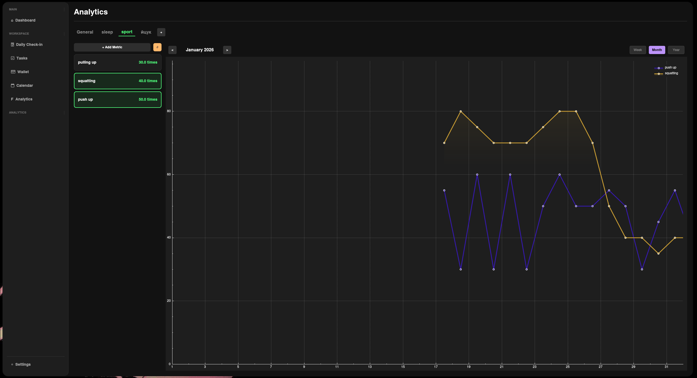
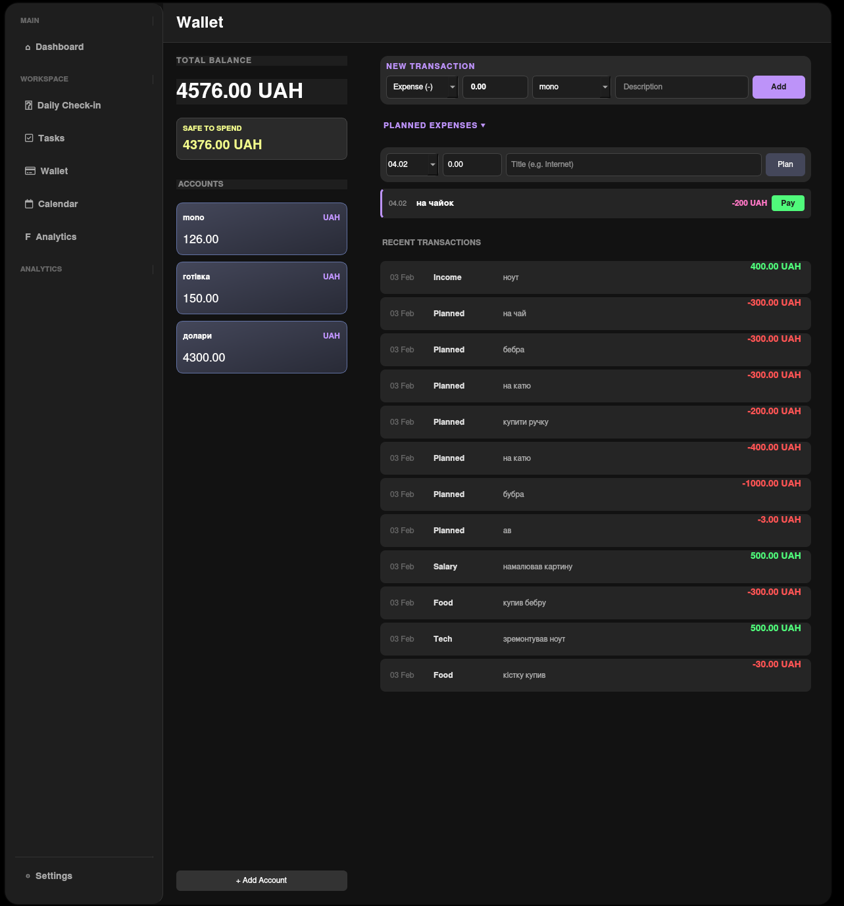

# Academic OS


> **Your personal operating system for productivity, learning, and life management.**
> *Built for speed. Built with C++.*


---

## ◈ The Ecosystem

**Academic OS** is not merely a task list or a habit tracker. It is a comprehensive desktop ecosystem designed to treat your life and studies as a high-priority managed project.

The system consolidates disparate tools—task management, financial tracking, personal analytics, and scheduling—into a single, cohesive interface. Data is visualized through a modular "Bento Grid" dashboard, providing an instant overview of your productivity, financial health, and habits without the clutter found in typical productivity software.

## ◈ The Philosophy: Why C++?

This project was born from a frustration with the modern software landscape. Most productivity tools today (Notion, Obsidian, etc.) rely on web technologies like Electron, which often results in sluggish performance, high memory usage, and "subscription fatigue."

**Academic OS takes a different approach:**
* **Native Performance:** Written in pure C++ and Qt, it offers instantaneous response times that web-based apps simply cannot match.
* **Local First:** Your data belongs to you. No clouds, no subscriptions, no accounts.
* **Distraction-Free:** A "Strict Dark" interface designed to keep you in the flow state, not to distract you with unnecessary animations.

## ◈ Current Constraints

While Academic OS is powerful, it is designed with specific engineering trade-offs:
* **Desktop Only:** Designed for deep work sessions on a computer, not for quick mobile checks.
* **Linux First:** While Qt is cross-platform, the current development focus and optimization are targeted at Linux environments (Arch/Ubuntu).
* **Compilation Required:** As a native application, it requires a build environment (CMake/Qt SDK) to run the latest version, unlike web apps that run in a browser.

---

## 📸 Gallery

| **Task Management** | **Dashboard & Widgets** |
|:---:|:---:|
|  |  |
| *Deep Nesting & Progress Tracking* | *Bento Grid Layout* |

| **Analytics Engine** | **Finance & Wallet** |
|:---:|:---:|
|  |  |
| *Multi-graph Overlay & Auto-scaling* | *Budget Planning & History* |

---

## 🛠️ Tech Stack & Requirements

This project maintains a codebase that is **>99% C++**, ensuring maximum control over memory and performance.

### Core Technologies
* **Language:** C++17
* **GUI Framework:** Qt 6 (Widgets module)
* **Build System:** CMake (3.16+)
* **Data Persistence:** Custom JSON Serialization (Auto-save)
* **Visualization:** QCustomPlot

### Build Requirements
To compile Academic OS from source, ensure you have the following installed:
* C++ Compiler (GCC / Clang / MSVC)
* Qt 6 SDK (specifically `qt6-base` and `qt6-charts` if applicable)
* CMake & Make (or Ninja)

---

## 🏗️ Installation & Build

**1. Clone the repository**
```bash
git clone [https://github.com/lomon23/AcademicOS.git](https://github.com/lomon23/AcademicOS.git)
cd AcademicOS
```
**2. Create a build directory
```bash
mkdir build && cd build
```
**3. Configure and Compile
```bash
cmake ..
make -j$(nproc)
```
**4. Run the application
```bash
./AcademicOS
```
## 👤 Author

**Lomon** - [GitHub Profile](https://github.com/lomon23)

<br>

<div align="center">
  <i>Developed with ❤️ and C++</i>
</div>