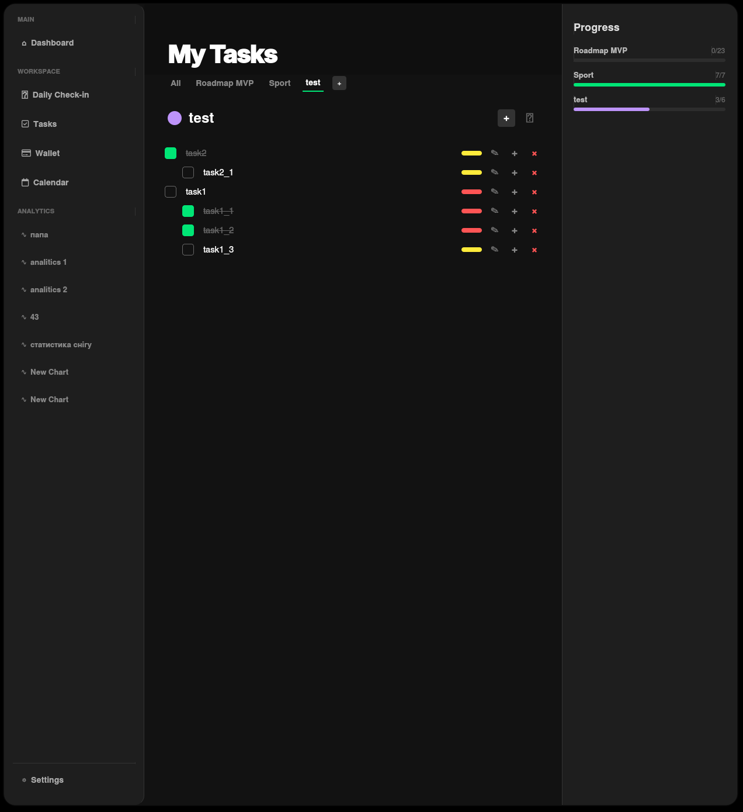
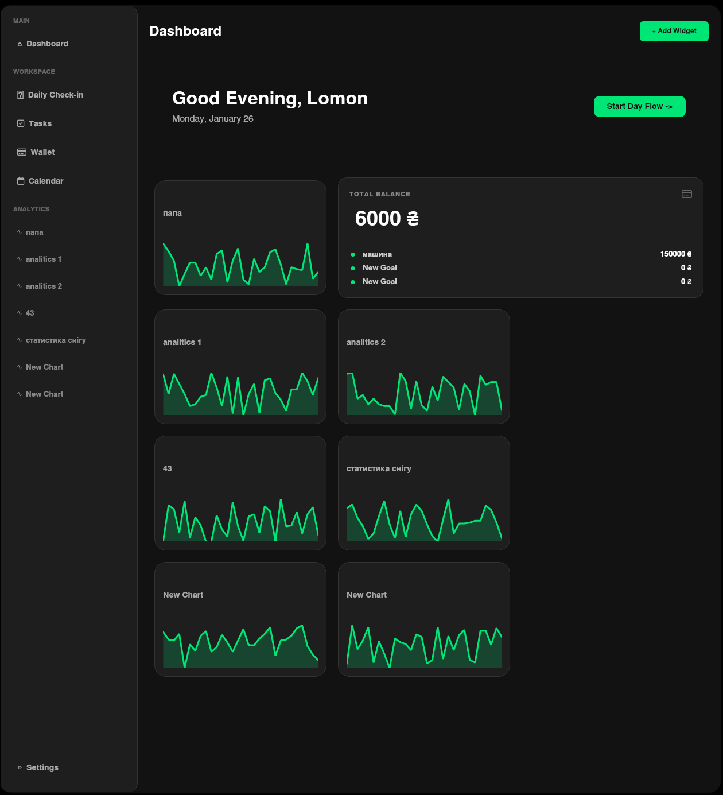

# 🎓 Academic OS


> **Your personal operating system for productivity, learning, and life management.**
> *Built with C++ & Qt.*


## 🚀 About The Project

**Academic OS** is not just another to-do list. It is a comprehensive desktop ecosystem designed for students who want to treat their life and studies as a managed project. 

Born from the need to have a fast, native, and distraction-free tool, Academic OS combines task management, financial tracking, and personal analytics into one cohesive interface.

---

## 🗺️ Roadmap & Module Status

### ✅ Completed & Stable
The **ToDo Module** is currently the core focus and is fully operational.

* **📝 To-Do Manager**
    * [x] Default structure.
    * [x] **CRUD Operations:** Create, Edit, Delete tasks instantly.
    * [x] **Deep Nesting:** Infinite sub-tasks support.
    * [x] **Categories:** Dynamic creation of lists with custom colors.
    * [x] **Smart Header:** Inline editing of list titles and colors.
    * [x] **Progress Tracking:** Visual progress bars for complex tasks.
    * [x] **UI/UX:** "Strict Dark" modern styling & Animations.

* **⚙️ Core System**
    * [x] Module Architecture.
    * [x] JSON Data Serialization (Auto-save).

### 🚧 In Progress / Planned
These modules are integrated into the UI but are currently under active development or planned for the next sprint.

* **📊 Dashboard**
    * [x] Default structure.
    * [ ] Widget Grid Layout.
    * [ ] Daily Summary View.

*📈 Analytics Engine

    *   [x] Multi-Graph Overlay: Visualize and compare multiple metrics on a single timeline.

    *   [x] Dynamic Categories: Create isolated tabs (e.g., Sport, Health, Code) for better organization.

    *   [x] Smart Visualization: Auto-scaling axes, gradient fills, and "Neon" color palette.
    
    *   [x] Multi-Select Interface: Toggle multiple metrics simultaneously via the sidebar.

    *   [x] Context Menu Controls: Right-click to Rename, Delete, or pick a Custom Color (RGB/HEX).

    *   [x] Backend Architecture: JSON-based storage with unit support (kg, min, times).

    ⚙️ Core System

    *   [x] Module Architecture.

    *   [x] JSON Data Serialization (Auto-save).

* **💳 Wallet 2.0**
    * [x] Default structure.
    * [ ] Transaction History.
    * [ ] Budget Planning.

* **📅 Productivity Tools**
    * [x] Default structure.
    * [ ] **Daily Check-in Page:** Morning/Evening routine logger.
    * [ ] **Welcome Screen:** Onboarding for new users.
    * [ ] **Settings:** Theme customization & data management.

---

## 📸 Gallery

| **Task Management** | **Bento Grid** |
|:---:|:---:|
|  |  |
| *Category Tabs & Nesting* | *Dark Theme & Clean Layout* |

---

## 🛠️ Tech Stack

* **Core:** C++17
* **GUI Framework:** Qt 6 (Widgets)
* **Build System:** CMake
* **Data Storage:** JSON (Custom serialization)
* **Charting:** QCustomPlot

## 🏗️ Getting Started

### Prerequisites
* C++ Compiler (GCC/Clang/MSVC)
* Qt 6 SDK
* CMake

### Installation

1.  Clone the repository:
    ```bash
    git clone [https://github.com/lomon23/AcademicOS.git](https://github.com/lomon23/AcademicOS.git)
    cd AcademicOS
    ```

2.  Create build directory:
    ```bash
    mkdir build && cd build
    ```

3.  Build the project:
    ```bash
    cmake ..
    make
    ```

4.  Run:
    ```bash
    ./AcademicOS
    ```

---

## 📊 Project Stats

[](https://github.com/lomon23/AcademicOS)


---

## 👤 Author

**Lomon** - [GitHub Profile](https://github.com/lomon23)

---
*Developed with ❤️ and C++*